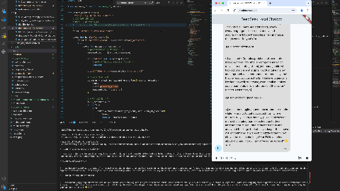

## Resume Summary with RAG

> [!IMPORTANT] 
> Description : Summarized Resume by RAG 
> - Code : https://github.com/akillness/SPTTC/blob/main/concept_of_transformer/open-framework/resume_summarizer.py

## DeepSeek R1 1.5B Local Test

> [!IMPORTANT] 
> Description : DeepSeek R1 distill qwen 1.5B Model, Local Web Socket Server 
> - Code : https://github.com/akillness/SPTTC/blob/main/concept_of_transformer/chatbot/web-server.py

## TinyLlama-1.1B-Chat-v1.0 Local CoT Streaming Test

> [!IMPORTANT] 
> Description : TinyLlama 1.1B Model, Local Reasoning Test 
> - Code : https://github.com/akillness/SPTTC/blob/main/concept_of_transformer/open-framework/sLM_wCoT.py

## Pipelines Methods

> [!IMPORTANT] 
> Description : <https://huggingface.co/docs/transformers/main/en/main_classes/pipelines>

> [!TIP]
> Examples : <https://github.com/huggingface/transformers/tree/main/examples/pytorch>

|Task| Description| Modality| Pipeline identifier|
|:--- | :--- | :---| :--- |
|Text classification|assign a label to a given sequence of text	|NLP|pipeline(task=“sentiment-analysis”)|
|Text generation | generate text given a prompt|NLP|pipeline(task=“text-generation”)|
|Summarization|generate a summary of a sequence of text or document|NLP|pipeline(task=“summarization”)|Image classification	assign a label to an image|Computer vision	pipeline(task=“image-classification”)|
|Image segmentation|assign a label to each individual pixel of an image (supports semantic, panoptic, and instance segmentation)|Computer vision|pipeline(task=“image-segmentation”)|
|Object detection| predict the bounding boxes and classes of objects in an image|Computer vision|pipeline(task=“object-detection”)|
|Audio classification|assign a label to some audio data | Audio | pipeline(task=“audio-classification”)|
|Automatic speech recognition|transcribe speech into text | Audio |pipeline(task=“automatic-speech-recognition”)|
|Visual question answering | answer a question about the image, given an image and a question|Multimodal|pipeline(task=“vqa”)|
|Document question answering | answer a question about the document, given a document and a question|Multimodal | pipeline(task=“document-question-answering”)|
|Image captioning | generate a caption for a given image | Multimodal |pipeline(task=“image-to-text”)|