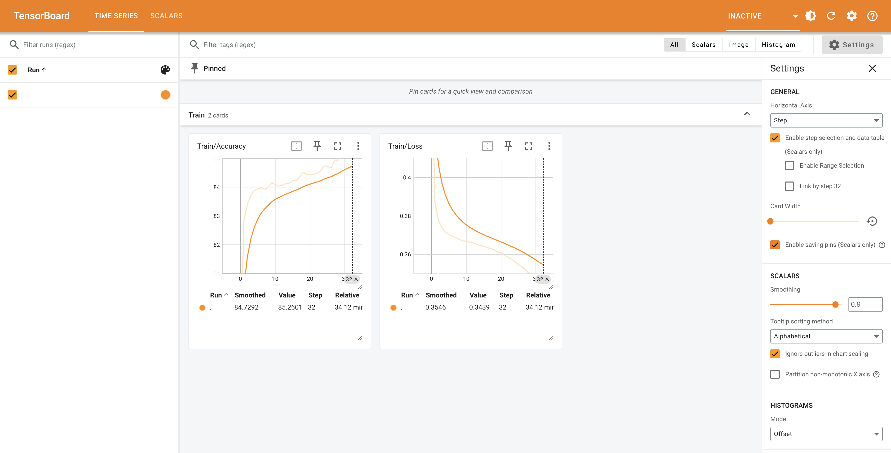

## RNN 기본 개념 정리

rnn_concept.py 파일로 RNN 개념을 간단하기 sudo? 형식으로 정리한 내용을 Backlog

## RNN 구현하기
## RNN Classification

>[!IMPORTANT]
> Traning ( rnn_train.py ) 과 Evaluation (rnn_eval.ipynb ) 코드를 나눠서 정리하였고, Tensorboard 및 model 학습 저장코드 추가 

## RNN Genration