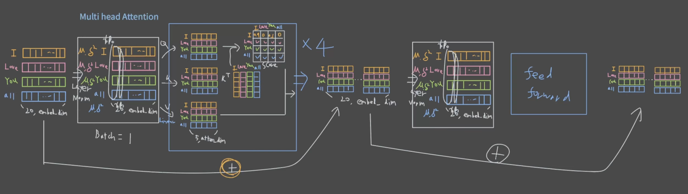
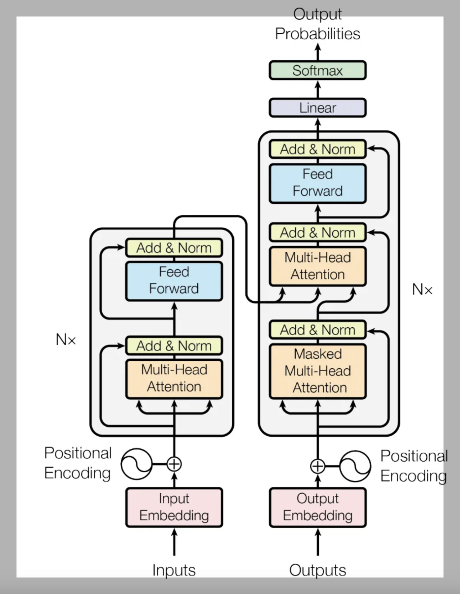

## Self-Attention Implemetation

### Self-Attention of Workflow Concept

Self-Attention 은 Query, Key, Value 를 이용해, Input Embedding 내 Word 간의 관계를 Matrix Score 로 계산하여 관계가 높을수록 high score, 낮을 수록 low score를 파악 할 수 있다.

- Query : 관계파악을 위한 Word 인지 제안하는 값
- Key : Query 에 상응하는 Word 에 대한 값
- Value : Q*K^T 로 얻은 Score 를 Probability로 변환하여 Attention weight로 바꿔주기 위한 값

### Self-Attention 

Linear 하게, Q,K,V 를 이용해 Input Embedding의 Attention Weight를 학습을 통해 관련성을 찾아가는 개념

- Query : 관계파악을 위한 Word 인지 제안하는 값
- Key : Query 에 상응하는 Word 에 대한 값
- Value : Q*K^T 로 얻은 Score 를 Probability로 변환하여 Attention weight로 바꿔주기 위한 값

### Multi-Head Attention

Self-Attention 을 통한 Input Embedding 의 Attention Weight를 정교하게 찾기 위해 Convolutional 방식의 Multi-Layer로부터 다양한 feature 정보를 얻기 위한 Multi-Head 개념

- 각 Multi-Head 의 개념을 가능하도록 LayerNorm 을 이용해, 학습시 각 Layer의 Distibution 의 Scale, Shift 를 학습 (평균과 분산은 Moving Average 로부터 얻음 )
  - 학습시 Vanishing Gradient가 발생하는 부분은 Feedforward 블록에서 ReLU 가 있기 때문

### Positional Encoding

Input 데이터는 Word를 순서에 맞춰 나열한 Sequence 이기 때문에, Input 데이터의 Word간 순서의 관계 정보 또한 중요한 부분이다.

Tokenizer 는 수많은 Word 의 Lookup Table 형태로 Vector Embedding 된 Index 정보만을 통해 Input 데이터의 Word Embedding 의 값을 전달해 주지만, Input 데이터로 구성된 Input 데이터의 순서는 입력 순서에 따라 Matrix 저장 후, Vector Embedding 값은 임의로 설정됨

Input 데이터의 Embedding 값을 설정해주는 방식
- 학습기반 ( Backpropagtion 을 통한 업데이트 방식 )
  - 임의의 각 Input Embedding = 임의의 각 Input Embedding + Lookup Table 내에 해당하는 각 Input Embedding 
- **Sin/Cos 이용하여 Vector Embedding 값을 순서대로 입력**
- RoPE ( Rotary Positional Encoding )

### Transformer Encoder

Multi-head Attentioon 에 LayerNorm 및 Skip-connection 을 활용하여 Attention 정보가 Vanishing 되지 않도록 Block 구조를 설계
- 각 Multi-Head 의 개념을 가능하도록 LayerNorm 을 이용해, 학습시 각 Layer의 Distibution 의 Scale, Shift 를 학습 (평균과 분산은 Moving Average 로부터 얻음 )
  - 학습시 Vanishing Gradient가 발생하는 부분은 Feedforward 블록에서 ReLU 가 있기 때문임

Encoder는 Transformer Block을 N 배수 만큼 쌓아 학습이 잘 되도록 설계

## Transformer 개념 추가
> [!IMPORTATN]
> Reference : <https://velog.io/@ailab/Transformer>